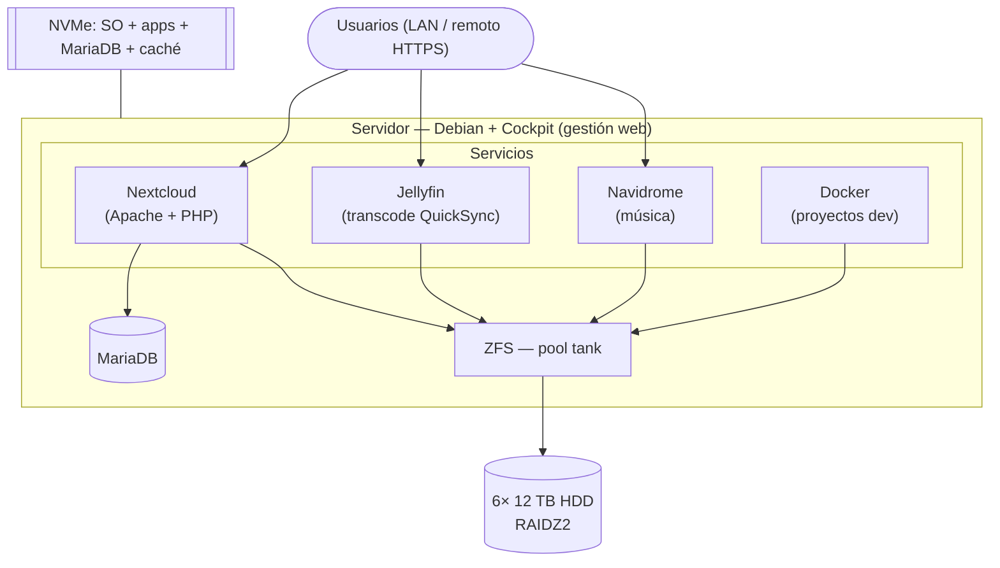

# 00 — Visión y alcance

## Objetivo
Nube privada del hogar, autoalojada sobre **Nextcloud**, que cubra dos necesidades:
1. **Nube familiar:** almacenamiento y sincronización para ~5 personas (fotos, documentos, etc.).
2. **Almacenamiento masivo del propietario:** preservación de videojuegos, películas, series, música, y alojamiento de proyectos/entornos de desarrollo.

Diseñada para **crecer de forma ordenada (5–10 años)** y poder **descentralizarse en varios hogares** con redundancia parcial.

## Alcance
- **Es:** infraestructura personal/familiar. Un servidor central hoy; varios servidores deslocalizados a futuro.
- **No es:** un producto comercial. La comercialización (pagos/suscripciones con Stripe sobre usuarios de Nextcloud) es una **hipótesis futura** que **no condiciona** las decisiones actuales.
- **Cancelado:** la arquitectura de microservicios (Spring: Auth, Gateway, Eureka, Config, Music) y el servicio de descarga de música desde YouTube.

## Usuarios
| Concepto | Valor |
|---|---|
| Usuarios hoy | ~5 (familia, incluido propietario) |
| Máximo previsto | ~8 |
| Capacidad ofrecida por usuario | objetivo 4 TB/persona (uso real estimado ~2 TB) |

> El cupo de Nextcloud es **lógico** (thin provisioning): se puede ofrecer 2–4 TB/persona aunque físicamente se tenga menos, porque ZFS solo ocupa lo realmente usado. Lo que se dimensiona es el **consumo real + margen**, con un camino de expansión claro.

## Tiers de datos
La clasificación por patrón de acceso y criticidad ayuda a **organizar los datasets**. Ver detalle en [02 — Almacenamiento](02-Almacenamiento.md).

| Tier | Datos | Tamaño | Acceso | Criticidad |
|---|---|---|---|---|
| HOT / crítico | Nextcloud familiar (fotos, docs) | Pequeño-medio | Diario | Irremplazable |
| Semi-crítico | Preservación de videojuegos | Medio, creciente | Esporádico | Difícil de re-conseguir |
| Pequeño | Música | ~0,15 TB | Frecuente | Bajo |
| COLD / bulk | Películas y series | Grande (TB) | Streaming | Recuperable |
| HOT | Proyectos / dev | Pequeño | Diario | En Git normalmente |

## Principios de diseño
- **Fiabilidad por encima de flexibilidad extrema** (RAIDZ2, ZFS con checksums).
- **Escalar por bloques homogéneos** (vdevs RAIDZ2 completos), sin mezclar geometrías en el pool.
- **Localidad de datos:** cada usuario accede a su servidor más cercano a velocidad de LAN.
- **No estirar un sistema de ficheros sobre la WAN** (si algún día hay un 2º hogar, ver [03](03-Red-y-Geodistribucion.md)).
- **Separar el cómputo del almacenamiento masivo:** SO/apps/BD en NVMe; el pool de HDD es solo `/data`.
- **Sin backup ni snapshots:** la única protección de datos es el **RAIDZ2** (decisión asumida; no cubre borrados, ransomware, robo ni incendio).

## Arquitectura lógica (software)

- **Separación de medios:** SO, apps, base de datos y caché en **NVMe**; los datos de usuario en el **pool ZFS de HDD**. Mejora rendimiento y reduce desgaste/escrituras sobre los discos lentos.
- **Cockpit** da panel web sin renunciar al control total por SSH (Debian puro).

## Hoja de ruta
1. **Fase 1 — Servidor único (actual).** Torre x86 + ZFS RAIDZ2 + Nextcloud + servicios. Una sola "isla".
2. **Fase 2 — Crecimiento vertical.** Añadir un 2º vdev RAIDZ2 al pool cuando se acerque al 80% de uso.
3. **Fase 3 — Descentralización (opcional).** 2º servidor en casa de un familiar por **subdominios** (`casa-b.levelcloud.hdglabs.com`, subordinado a A), islas **independientes sin copia entre casas** ([03](03-Red-y-Geodistribucion.md)).
4. **Fase 4 (hipotética) — Comercialización.** Capa de pagos sobre Nextcloud. Sin compromiso.
