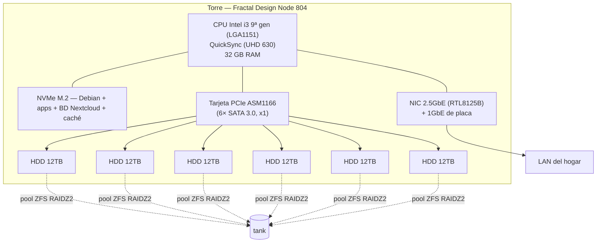

# 01 — Hardware

## Filosofía
Un **único equipo** (torre x86) que hace de **cabeza de cómputo + NAS**: el SO, las apps y la base de datos viven en NVMe; los discos mecánicos forman el pool ZFS de datos. Se recarcasa la torre actual en una caja con bahías en lugar de usar un DAS externo.

## Diagrama del servidor

## Componentes

### Base (ya disponible)
| Componente | Detalle | Notas |
|---|---|---|
| CPU | Intel **i3 9ª gen** (socket LGA1151) | Suficiente para ~5 usuarios. **QuickSync** → transcodificación por hardware en Jellyfin. Ruta de upgrade a i7/i9-9ª gen en el mismo socket |
| RAM | 16 GB → **ampliar a 32 GB** | ZFS usa RAM como caché (ARC); además Docker + Nextcloud + dev. 64 GB posible a futuro |
| Placa base | 2 puertos SATA | Insuficientes para el pool → se añade tarjeta PCIe (abajo) |

### A comprar (decidido)
| Componente | Modelo / spec | Por qué |
|---|---|---|
| **Caja** | **Fractal Design Node 804** | Caja cubo microATX para NAS, **8–10 bahías de 3,5"**, buen flujo de aire. Acepta placas mATX/ITX |
| **Controladora SATA** | **Tarjeta PCIe ASM1166, 6 puertos** | Chip ASMedia **nativo de 6 puertos, sin port multiplier**. Compatible Linux |
| **Discos** | **6× 12 TB NAS CMR** (IronWolf Pro / WD Red **Plus** / Toshiba N300) | Pool RAIDZ2. Ver [02 — Almacenamiento](02-Almacenamiento.md) |
| **Disco OS** | **NVMe M.2** | Debian + apps + BD/caché de Nextcloud, fuera del pool |
| **Red** | **NIC 2.5GbE YuanLey — Realtek RTL8125B** (PCIe, compatible x1/x4/x8/x16) | RJ45 2500 Mbps, Windows/Linux/macOS. La LAN de 1 GbE (~110 MB/s) es el cuello de botella local; 2.5GbE da ~280 MB/s sobre cableado Cat5e/Cat6 |

> **Driver en Linux (RTL8125B):** soportado por el kernel ≥ 5.9 (módulo `r8169`). En Debian *stable* con kernel antiguo puede requerir el driver **`r8125` (DKMS)** de Realtek o un kernel desde *backports*. Verificar `ethtool eth0` muestra 2500 Mb/s tras instalar.

### Interfaces de red
- **2 interfaces** recomendadas: la **2.5GbE YuanLey (RTL8125B)** como principal + la **1GbE de placa** como secundaria (respaldo de red o VLAN de gestión/invitados).
- Escalar a **2× 2.5GbE en LACP** (tarjeta doble puerto + switch gestionable) solo si varios usuarios saturan a la vez los 280 MB/s. Un solo flujo siempre topa a 2.5GbE; LACP solo agrega con varios clientes simultáneos.
- **10GbE: descartado por ahora** — un vdev de 6 HDD no lo sostiene y el ecosistema (switch, Cat6a, calor) no compensa. Puerta abierta vía el slot PCIe x16.
- ⚠️ Para obtener 2.5GbE real, NAS **y** cliente deben colgar de **puertos 2.5GbE** (switch 2.5GbE). La NIC sola no basta si el switch es de 1 GbE.
- La replicación al 2º hogar (Fase 3) **no** necesita NIC dedicada: va por internet/VPN.

### Ampliación RAM
> Con un pool de ~36 TB y varios servicios concurrentes, **32 GB** es el mínimo cómodo. Si se tira mucho de dev/contenedores + Jellyfin a la vez, considerar **64 GB** (la placa LGA1151 lo admite). No se requiere ECC para este caso de uso.

## Fuente de alimentación (PSU)
Sin tarjeta gráfica dedicada, el equipo consume poco. Lo que dimensiona la fuente **no es el consumo en marcha, sino el pico de arranque de los discos** (cada HDD tira fuerte del raíl de **12V** al arrancar el motor).

| Componente | En marcha | Pico arranque (12V) |
|---|---|---|
| CPU i3 9ª gen | ~65 W | ~90 W |
| Placa base + RAM | ~45 W | — |
| NVMe | ~6 W | — |
| 6× HDD 12 TB (CMR) | ~50 W (activos) | **~170 W (spin-up simultáneo, ~28 W/disco)** |
| NIC + ventiladores | ~18 W | — |
| **Total** | **~185-210 W** | **~300-330 W (arranque en frío)** |

**Una fuente de calidad de 450-550 W ya sobraría.** La **≈750 W actual va de sobra**, incluso con el **2º vdev futuro** (12 discos ≈ ~360-400 W de pico) → **no hace falta comprar fuente nueva**. Verificar:
- Marca decente / **certificación 80+** y buen estado (no una no-name muy vieja).
- **≥6 conectores de alimentación SATA** (el NVMe va por la placa; usar splitters si faltan).
- (Opcional) **spin-up escalonado** en la controladora/ZFS si preocupa el arranque en frío; con 750 W no es necesario.

> La **iGPU del i3 (UHD 630) se mantiene** al retirar la GPU dedicada — es la que da **QuickSync** para Jellyfin. Habilitarla en BIOS.
> Un **SAI/UPS** protege ante cortes de luz (no es backup): ZFS aguanta cortes mejor que otros FS, pero un SAI evita daños y permite apagado limpio. Opcional.

## Inventario / especificaciones del servidor
> Pendiente de completar con los modelos exactos. ⏳ = falta el dato.

| Componente | Especificación | Estado |
|---|---|---|
| Placa base | modelo ⏳ (microATX para Node 804; 2× SATA; ≥2 slots PCIe libres; 1× M.2) | ⏳ |
| CPU | Intel Core i3 **9ª gen** — modelo exacto ⏳ | ⏳ |
| RAM | 16 GB actuales → **32 GB**; tipo/velocidad ⏳ | parcial |
| **Fuente (PSU)** | **≈ 750 W**; marca / modelo / certificación ⏳ | ⏳ verificar |
| GPU | **se retira** (no necesaria; queda la iGPU UHD 630) | decidido |
| Disco SO | **NVMe M.2**; modelo / capacidad ⏳ | ⏳ |
| Caja | Fractal Design Node 804 | decidido |
| Controladora SATA | PCIe ASM1166 (6 puertos) | decidido |
| Discos pool | 6× 12 TB NAS CMR (RAIDZ2) | decidido |
| Red | YuanLey 2.5GbE (RTL8125B) + 1GbE de placa | decidido |

## Avisos de montaje

### Tarjeta ASM1166 (PCIe x1)
- **Comprar la variante de 6 puertos ASM1166 puro.** Evitar variantes de 8/10 puertos basadas en **JMB575** (port multiplier) — poco fiables con ZFS.
- Es **PCIe x1**: para el uso normal (red 2,5GbE) va sobrada, pero los **scrub/resilver son más lentos** porque los 6 discos comparten un carril. Aceptable en entorno doméstico. (Para eliminar este límite, alternativa pro: **HBA LSI 9207-8i en modo IT**, x8.)
- En la **BIOS**, modo SATA en **AHCI**. Instalar la tarjeta en cualquier slot (x1 físico entra en x4/x16).

### Alimentación y refrigeración
- Verificar que la **fuente** tiene suficientes **conectores de alimentación SATA** (6 discos + SSD); usar splitters si hace falta. 6 HDD giratorios ≈ 50 W en marcha, picos mayores al arrancar.
- El Node 804 refrigera la jaula de discos con sus ventiladores; **no dejar discos sueltos** (vibración y calor → fallos prematuros).

## Por qué recarcasar y no un DAS
- Una tarjeta PCIe SATA es **interna**: solo aporta puertos de datos. Los discos siguen necesitando **bahía** (sitio físico) y **alimentación** (de la fuente). Por eso la caja con bahías es imprescindible.
- Un **DAS USB** queda descartado para el pool (oculta SMART, resetea discos, comparte ancho de banda). La única alternativa "externa" válida sería un **JBOD SAS + HBA**, más caro y ruidoso; innecesario para un hogar.
