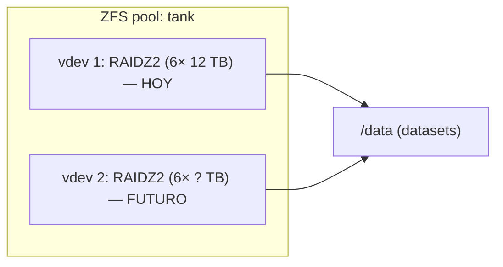
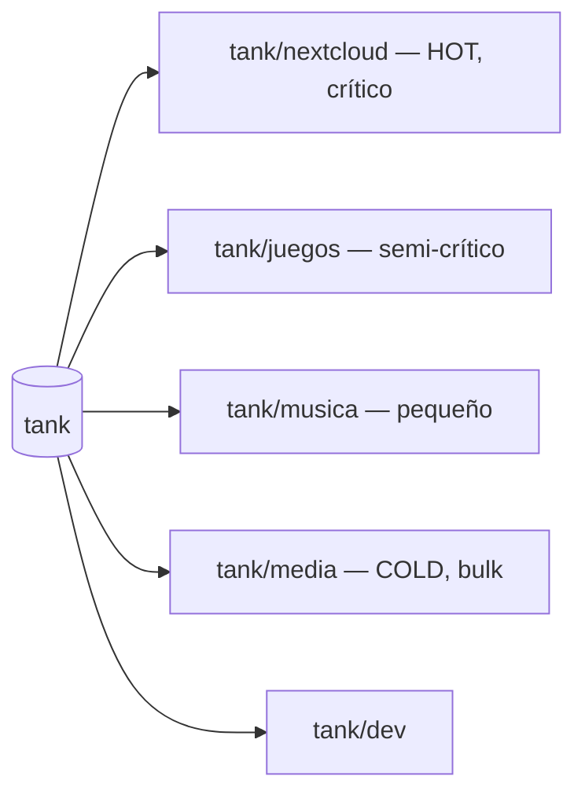

# 02 — Almacenamiento (ZFS / RAIDZ2)

## Decisión: ZFS + RAIDZ2
Se usa **ZFS** con un vdev **RAIDZ2** (doble paridad). Se descartan explícitamente:
- **RAIDZ1 / RAID5:** con discos grandes (12 TB) el *resilver* dura días; RAIDZ1 deja **cero paridad** en ese tiempo y un 2º fallo (habitual al estresar discos del mismo lote) se lleva el pool.
- **mergerfs + RAID1 / RAID10:** renuncia a los checksums, la compresión y el `send/recv` de ZFS.

> **ZFS quiere los discos directos (HBA / modo IT), nunca tras una controladora RAID hardware.** El RAID lo hace ZFS por software; Debian + OpenZFS es la base correcta (es el mismo motor que usa TrueNAS).

## Configuración del pool
| Parámetro | Valor |
|---|---|
| Sistema de archivos | ZFS (OpenZFS en Debian) |
| Topología inicial | 1 pool `tank`, 1 vdev **RAIDZ2 de 6× 12 TB** |
| Compresión | **LZ4** (activada; impacto de CPU despreciable) |
| Snapshots | No (decisión: sin backup) |
| Scrub | Programado (mensual) |
| Regla de uso | No superar el **80%** de ocupación |

## Capacidad real
Cuentas honestas incluyendo **2 discos de paridad**, conversión **TB→TiB** (un disco de "12 TB" ≈ 10,9 TiB) y overhead de ZFS:

| Config (RAIDZ2, 6 discos) | Bruto marketing | Tras paridad (4 discos de datos) | Real en TiB (−9 %) | Tras overhead ZFS | **Cómodo (80 %)** |
|---|---|---|---|---|---|
| 6× 8 TB | 48 TB | 32 TB | 29,1 TiB | ~27,9 TiB | **~22 TiB** |
| **6× 12 TB** ✅ | 72 TB | 48 TB | 43,6 TiB | ~41,5 TiB | **~33 TiB** |
| 6× 16 TB | 96 TB | 64 TB | 58,2 TiB | ~55,8 TiB | **~44 TiB** |

**Necesidad estimada:** ~13 TB hoy (uso práctico) → ~27 TB en el escenario de 4 TB/persona. Los **6× 12 TB (~33 TiB cómodos)** lo cubren con margen.

### Discos
- **3,5" NAS, CMR, 24/7.** Modelos: Seagate IronWolf / IronWolf Pro, WD Red **Plus**/Pro, Toshiba N300.
- ⛔ **Nunca SMR** (destroza el resilver de ZFS). El "WD Red" a secas es SMR → usar **Red Plus/Pro**.
- Comprar de **lotes/tiendas distintas** para reducir el fallo correlacionado durante un resilver.

## Crecimiento
La estrategia ZFS para crecer: **añadir un 2º vdev RAIDZ2** (otro grupo de discos) al **mismo pool**. La capacidad suma y sigue siendo un único `/data` para Nextcloud; además más vdevs = más IOPS.

Reglas:
- Crecer en **módulos completos** (vdev RAIDZ2 entero), homogéneos.
- **No mezclar geometrías** distintas en el mismo pool.
- La caja Node 804 (8–10 bahías) admite el 1º vdev y parte del 2º; para 12 discos completos valorar caja mayor o un 2º equipo.
- *Nota:* OpenZFS 2.3 (2024) permite **expandir un vdev RAIDZ disco a disco**, pero añadir un vdev nuevo rinde mejor y rebalancea mejor.

## Datasets y tiering
Crear **datasets separados por tipo** desde el día 1: permite **cuotas por tipo** y una organización clara (y, si algún día hay 2º hogar, definir el alcance — ver [03](03-Red-y-Geodistribucion.md)).

| Dataset | Tier | Motivo |
|---|---|---|
| `tank/nextcloud` | HOT, crítico | Irremplazable (fotos, docs familiares) |
| `tank/juegos` | Semi-crítico | Proyecto de preservación, difícil de re-conseguir |
| `tank/musica` | Pequeño | Pesa poco |
| `tank/media` | COLD, bulk | Decenas de TB, recuperable |
| `tank/dev` | HOT | Normalmente ya está en Git |

## Integración con Nextcloud
- Nextcloud solo ve `/data`; no conoce la estructura interna del pool → la expansión (nuevos vdevs) es **transparente**.
- La **BD (MariaDB)** y la caché de Nextcloud van en **NVMe**, no en el pool de HDD (rendimiento y menos desgaste). Ver [Sistema/Nextcloud.md](../../Sistema/Nextcloud.md).
