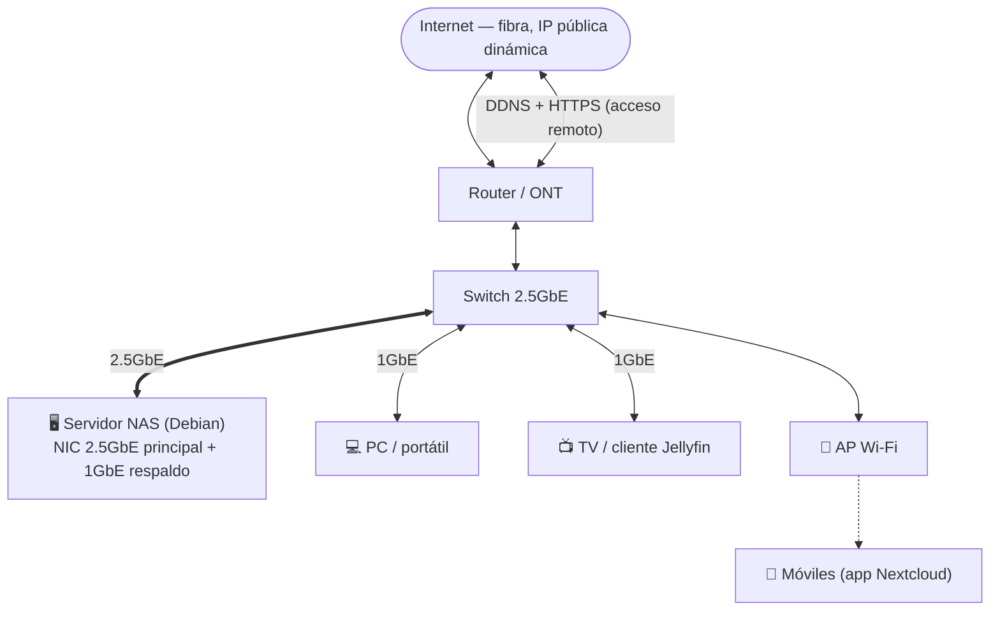
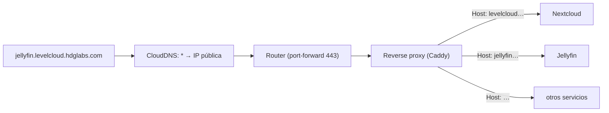
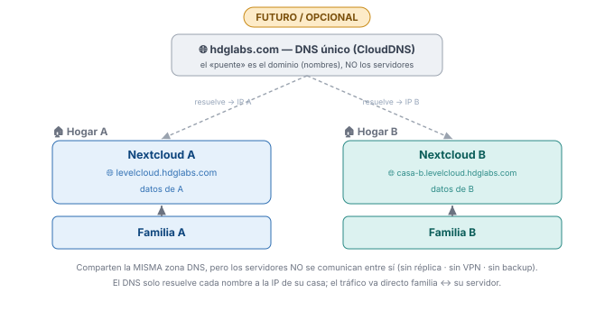
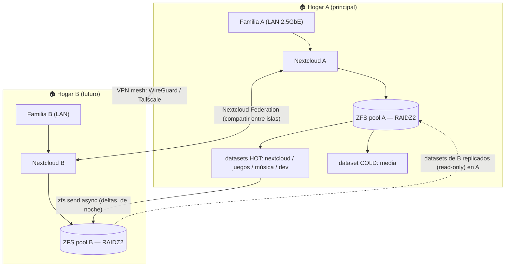

# 03 — Red y geo-distribución

## Red actual (Fase 1, un solo hogar)
| Parámetro | Valor | Notas |
|---|---|---|
| LAN | 1 Gbps → **2,5 GbE** | 1 GbE ≈ 110 MB/s es el cuello de botella real en LAN; los discos dan más |
| NIC | **YuanLey 2.5GbE (Realtek RTL8125B)** + 1GbE de placa | 2 interfaces: 2.5GbE principal + 1GbE secundaria (respaldo/VLAN). Ver [01-Hardware](01-Hardware.md#interfaces-de-red) |
| Switch | 2.5GbE | Necesario para que la velocidad 2.5GbE sea real entre NAS y clientes |
| IP pública | **Dinámica** | Resuelta con **DDNS** (dominio `*.ddns-ip.net`) |
| Acceso externo | HTTPS (Apache + Let's Encrypt) | Ver [Sistema/Nextcloud.md](../../Sistema/Nextcloud.md) |

> **La velocidad ofrecida depende de a quién:**
> - **Local (LAN):** la limita la red → objetivo **2.5GbE (~280 MB/s)**, que los discos pueden alimentar.
> - **Remoto (fuera de casa):** lo limita la **subida residencial asimétrica** del ISP, no el servidor ni la NIC. Una NIC más rápida no mejora el acceso remoto.

### Topología LAN actual

> El enlace **NAS↔switch a 2.5GbE** es el que conviene priorizar; el resto de clientes pueden ir a 1GbE sin penalizar al servidor (cada uno usa su propio enlace).

## Exposición de servicios (wildcard DNS + reverse proxy)
Para exponer varios servicios (Nextcloud, Jellyfin, etc.) bajo subdominios **sin registrar uno a uno** en CloudDNS (que limita a ~50 registros):

1. **Un registro wildcard** en CloudDNS: `*.levelcloud.hdglabs.com` → IP pública. Un solo registro cubre **infinitos** subdominios.
2. **Reverse proxy** en el servidor (**Caddy** o **Nginx Proxy Manager**): lee la cabecera `Host:` y enruta cada subdominio al servicio interno; gestiona **HTTPS automático**.
3. **Router** (Vodafone): solo **port-forward 80/443** al servidor. No necesita registros DNS.

- **El enrutado por subdominio lo hace el reverse proxy (por `Host`), no el DNS ni el router.**
- **Certificado:** para HTTPS en subdominios arbitrarios, **cert wildcard** vía **DNS-01** (requiere API de CloudDNS); si no, cert por subdominio (HTTP-01). Caddy/NPM lo automatizan.
- **IP dinámica:** un cliente **DDNS** mantiene el registro al día.
- **CGNAT:** verificar que hay IP pública real; si hay CGNAT, usar un túnel (Cloudflare Tunnel / Tailscale Funnel).
- **Ligero:** Caddy consume ~decenas de MB. Opcional **Pi-hole/dnsmasq** (pocos MB) para resolución local (split-horizon) y bloqueo de anuncios.
- **Geo (futuro):** `casa-b.levelcloud.hdglabs.com` sería un **registro explícito → IP de B** (un registro específico prevalece sobre el wildcard).

## Geo-distribución (Fase 3) — FUTURO / OPCIONAL

> 🟡 **Estado: futuro y opcional. NO se construye ahora.** El servidor único (Fase 1) funciona y aporta el 100 % del valor por sí solo. Esto es el plan para *cuando* exista un 2º hogar con usuarios reales — documentado para no improvisar, **no** como compromiso. Nada de aquí condiciona lo que se monta hoy, y todo es probable en VM/VPS antes de tocar nada real.

Objetivo: **2º servidor en casa de un familiar**, accesible bajo **un solo dominio** y **sin saturar la WAN**.

### Modelo elegido (decisión actual)
- **Acceso:** **subdominios**, uno por casa, con jerarquía:
  - `levelcloud.hdglabs.com` → **casa A (principal)**
  - `casa-b.levelcloud.hdglabs.com` → **casa B**, que **cuelga por debajo del nombre de A** (subordinado, no al mismo nivel). Técnicamente válido: `levelcloud` puede ser host y a la vez nodo padre de `casa-b`.
  - Cada casa tiene su Nextcloud, su DNS y su certificado → **islas 100 % independientes, sin master ni punto único de fallo**.
  - Se **descarta GSS**: maquinaria de empresa para 8 usuarios y crea un **SPOF de login** (si A cae, B no puede ni entrar).
  - 🌐 **Único punto común = la zona DNS** (`hdglabs.com` en CloudDNS, que aloja ambos subdominios). Es un **puente de nombres, no de datos**: el DNS solo resuelve cada subdominio a la **IP de su casa** y el tráfico va **directo** familia↔su servidor. Los servidores **no se comunican** entre sí.
- **Datos:** modelo **SIMPLE** — **sin replicación cruzada ni copia entre casas, sin VPN entre servidores**. Cada casa es **independiente**.
- ⚠️ Contrapartida asumida (decisión del usuario): **sin backup**. Más allá de lo que tolere el propio RAIDZ2, los datos perdidos **no se recuperan**.

> Las secciones siguientes describen el **menú completo y las alternativas** (incluida la red de seguridad por replicación cruzada, **no elegida** ahora) por si en el futuro cambia la decisión.

### Principio base: la cuenta y los datos de un usuario viven juntos
Cada usuario está alojado **entero en un servidor** (su "hogar"): su cuenta **y** sus datos. No se separa "cuenta aquí, datos allá". Analogía: el **email** — dos servidores independientes, cada uno aloja a sus usuarios y se interoperan (compartir + copia). El ID federado de Nextcloud es literalmente `usuario@servidor`.

### El "triángulo imposible"
Sobre WAN doméstica no caben las tres a la vez: (1) un DNS / experiencia unificada, (2) acceso local sin pasar por el servidor principal, (3) el mismo dato editable en vivo desde ambas casas. **(1)+(2) sí; (3) rompe por física** (un archivo editable rápido vive en un sitio; el bulk no cabe por la subida). Se sustituye (3) por: datos locales + carpetas compartidas + copia cruzada para DR.

### ❌ Lo que NO se debe hacer
Estirar un único pool ZFS o un sistema distribuido (Ceph/Gluster/DRBD) **sobre la WAN**. Esos sistemas asumen latencia y ancho de banda de **LAN**; sobre internet residencial (decenas de ms, subida asimétrica, IP dinámica/CGNAT) se degradan o se caen. Cada escritura cruzaría la WAN → cada guardado en Nextcloud se volvería lentísimo. **Ese es el cuello de botella estructural a evitar.**

### Alternativa (NO elegida): *data locality* + replicación asíncrona

Tres capas:

1. **Localidad de datos.** Cada sitio es **primario de sus propios usuarios**; cada familia pega contra su servidor local a velocidad de LAN. ~95 % de los accesos nunca tocan la WAN.
2. **Replicación asíncrona del tier crítico** (no del bulk). `zfs send -i` sobre snapshots (automatizado con **syncoid/sanoid**) envía **solo los deltas**, comprimidos, de madrugada y con throttling. Al ser asíncrono, la latencia de la WAN es irrelevante y no bloquea a nadie. El **bulk de media NO se replica** (no cabe por la subida): copia local únicamente.
3. **Red entre sitios: VPN mesh.** Túnel **WireGuard** site-to-site, o **Tailscale/Headscale** si se quiere resolver automáticamente el NAT-traversal/CGNAT y la **IP dinámica**. La replicación viaja por dentro del túnel.

### Qué significa (y qué NO) "active-active federado"
- **Dos Nextcloud independientes**, uno por hogar (dos "islas"), cada uno rápido en su LAN. Por debajo son 2 instancias; el usuario percibe 1 dirección + 1 cuenta.
- **Nextcloud Federation** para *compartir* archivos/carpetas entre islas cuando haga falta.
- La **redundancia NO la da la federación**, la da la **replicación ZFS**, **unidireccional por dataset**: cada hogar es **master de sus datos** y los replica al otro como **copia de solo lectura**. Si A cae, B tiene una copia reciente read-only de A que se restaura/promueve. Eso es la "redundancia parcial".
- ⚠️ No hacer el **mismo dataset** escribible en los dos lados (multi-master no soportado por `send/recv`).

### La replicación NO es 1:1
Solo se replica el **tier crítico** (Nextcloud personal + carpeta compartida + música ≈ pocos TB), **nunca** el bulk. Por eso el hogar B puede ser **mucho más pequeño** (p. ej. ~8 TB) e incluso **sin redundancia local**: la **replicación entre casas hace de red de seguridad** (si B pierde un disco, A tiene la copia; y viceversa). Cada casa cuida lo crítico de la otra.

### Front-end: redirige como un router, NO hace de proxy
Para tener **un solo dominio** (`hdglabs.com`) sin que los datos del otro servidor pasen por el principal (lo que consumiría tu ancho de banda y el del otro a la vez), el front-end debe **redirigir** al nodo del usuario, no **tunelizar** sus bytes.

**¿A qué nivel vive ese selector/redirector?** Depende de por qué enrutes:
- **Nivel Nextcloud (por usuario):** el **Global Site Selector**. Solo Nextcloud conoce la identidad *después* del login, así que es el único que puede enrutar por **usuario** (usuario X → su nodo).
- **Nivel servidor / DNS (por ubicación):** **split-horizon DNS** resuelve `hdglabs.com` al servidor local de cada red.
- Un **reverse proxy** puro (nivel servidor) **no** puede enrutar por usuario antes del login; y si reenvía los bytes, se convierte en embudo (lo que hay que evitar).

Opciones verificadas:

| Opción | ¿Una URL? | ¿Embudo de datos? | Esfuerzo | Notas |
|---|---|---|---|---|
| **Subdominios** ✅ *(elegida)* `levelcloud` / `casa-b.levelcloud.hdglabs.com` | ❌ dos hostnames | No | Mínimo | Lo más simple y robusto; islas independientes, **sin SPOF** |
| **Split-horizon DNS** | ✅ en casa | No | Bajo | `cloud.hdglabs.com` → servidor local; el caso "de viaje / otra casa" se cubre con la VPN. **Recomendada como punto dulce** |
| **Nextcloud Global Site Selector (GSS)** — *descartada (overkill + SPOF de login)* | ✅ siempre, auto | No (**redirige**) | Alto | Oficial y mantenido (v2.6.0, compat NC31). Login en el master → **redirect** al nodo, que sirve los datos directo. Mapeo usuario→nodo por **fichero JSON** o **endpoint remoto** (sin plugin propio). Requiere identidad central (OIDC/LDAP) + Lookup Server. Maquinaria enterprise para 8 usuarios |
| Proxy único que tuneliza | ✅ | ❌ **sí, peor** | Medio | **Evitar**: funelea todos los bytes por un servidor |

> GSS verificado (jun 2026): [README oficial](https://github.com/nextcloud/globalsiteselector/blob/master/README.md) · [releases v2.6.0 / NC31](https://github.com/nextcloud/globalsiteselector/releases) · [Global Scale — cómo funciona](https://nextcloud.com/blog/nextcloud-global-scale-how-it-works/). ⚠️ La ficha del [App Store](https://apps.nextcloud.com/apps/globalsiteselector) está **obsoleta** (v1.3.0); se instala desde GitHub.

### Mitigaciones del ancho de banda
- Replicar **solo el tier crítico**, comprimido y solo deltas.
- Ventanas **nocturnas** + throttling para no competir con el uso diurno.
- Si la subida residencial se queda corta, alojar el nodo réplica en un **VPS/colo o storage box** (p. ej. Hetzner) como destino de `zfs recv`.

## Fases de red
1. **Hoy:** un hogar, LAN 2,5GbE, DDNS + HTTPS. **No montar nada de federación todavía.**
2. **Futuro:** levantar el 2º servidor → túnel WireGuard/Tailscale → `syncoid` para los datasets críticos → Nextcloud Federation para compartir entre islas.
