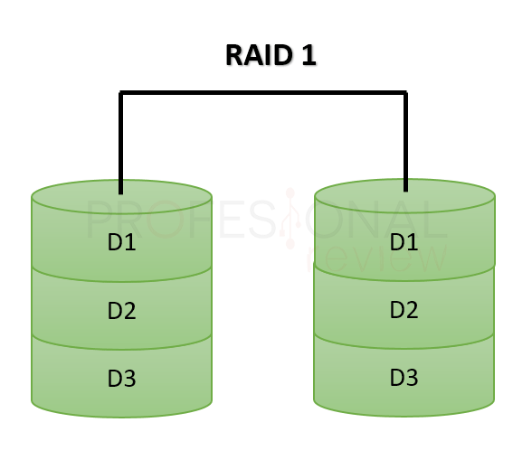

# Arquitectura de datos

## Tipo de RAIDS
### Inicial
El Tipo de Raid que utilizaremos inicialmente será "`Raid 1`" de **12Tb** cada disco, 
esto quiere decir que tendremos **12Tb** en total para nuestros usuarios.

### Avanzado
En el futuro tal vez nos interese tener Velocidad y Redundancia. Para ello usaríamos una estrategia Raid 1+0, ya que nos permite velocidad y una buena redundancia a fallos.

### Características

**Rendimiento:** Muy rápido, ya que combina la velocidad de RAID 0 y la redundancia de RAID 1. La escritura es limitada por el más lento de los discos del espejo, pero la lectura puede escalar bien porque los datos pueden ser leídos de cualquiera de los espejos.

**Redundancia:** Alta. Puede tolerar fallas múltiples siempre y cuando no sean del mismo espejo.

**Ideal para:** Sistemas que necesitan alto rendimiento (lectura/escritura) y alta disponibilidad.

## Estrategia de Fusión de almacenamiento

### Uso de `mergefs`
Para la gestión eficiente de almacenamiento en el sistema cloud, utilizaremos `mergefs`. Esto nos permitirá combinar varios discos o arreglos RAID en un único volumen lógico.

#### **Ventajas de `mergefs`:**
1. **Transparencia para los usuarios:**  
   Combina discos en un único punto lógico sin impactar la experiencia del usuario. Nextcloud verá un único sistema de datos.

2. **Sin necesidad de formateo:**  
   Los discos existentes se pueden integrar sin perder datos.

3. **Escalabilidad:**  
   Se pueden agregar discos o arreglos RAID adicionales sin interrupción.

4. **Tolerancia a fallos:**  
   Si cada unidad subyacente es un RAID (por ejemplo, RAID 1), la redundancia se mantiene.

5. **Políticas personalizables:**  
   Distribuye datos automáticamente según criterios como espacio libre o prioridad.

6. **Compatibilidad y flexibilidad:**  
   Funciona con cualquier combinación de discos y arreglos RAID, y no depende de hardware especializado.

#### **Por qué es ideal para nuestro sistema cloud:**
- Simplifica la gestión de almacenamiento.
- Permite el crecimiento continuo sin reconfiguraciones complejas.
- Garantiza la redundancia y rendimiento sin comprometer la experiencia de los usuarios.

