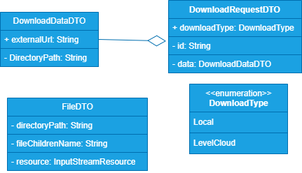

# Microservicio Music

## Diagramas
### Diagrama arquitectura microservicios


### Diagrama de secuencia


### Diagrama de clases


## Propósito del microservicio

El objetivo es desarrollar un microservicio que en principio sería consumido por múltiples aplicaciones con propósitos distintos. La función principal de esta API es ofrecer herramientas para crear aplicaciones que sean **Galerías de música** con la música propiedad de los usuarios. De modo que puedan:

- **Crear playlists**.
- **Ver los artistas que tienen y sus álbumes**.
- **Reproducir la música**.
- **Guardar el estado de progreso de la misma**.

Además, esta API permitirá a los usuarios:

- **Descargar canciones de YouTube de forma más rápida y sencilla**.
- **Almacenar estas mismas canciones** con distintas soluciones:
  - **Almacenamiento en la nube** de nuestro usuario en el servicio cloud que ofrecemos.
  - **Guardar en el dispositivo local** del usuario.


# Sprint 1
## Music downloader
### Restricciones
Esta funcionalidad tendra en principio 2 tipos de opciones para el usuario:
1. Descarga local:
> Esta opción no requiere de ningun tipo de validación previa
2. Descarga en el servicio en la nube:
> Esta opción si requiere de validaciones previas como que el usuario este autenticado cuando solicita tal acción
### Desarrollo
Este microservicio va a **consumir un microservicio (_"MS"_)** `Nextcloud MS`

Cuando un usuario desee descargar una canción, se llamará al endpoint `/download` del microservicio `Music`.
En el caso de que el endpoint haya recibido en el body que la descarga sera de tipo , el servicio no realizara ningun tipo de validación.

Sin embargo si es de tipo nextcloud. El servicio realizará algunas validaciones previas a la ejecución de la lógica del microservicio. Algunas de las validaciones son:

- El usuario debe estar autenticado.
- El usuario debe tener un plan de suscripción activo. `Servicio nextcloud`[[^1]](#1)
- El usuario debe tener suficiente espacio en su almacenamiento para descargar las canciones. `Servicio nextcloud`
- La ruta de descarga debe ser correcta. `Servicio nextcloud`
---
#### [[^1]]() 
>Servicio Nextcloud : quiere decir que esa validación no le corresponde a Music. Si no al microservicio nextcloud
---
Una vez todos los requisitos previos se cumplan, se realizará la descarga de la canción utilizando la herramienta `yt-dlp`, que se encargará de descargar la canción y almacenarla en la ruta temporal del sistema operativo[[^2]](#2) y posteriormente en base a la opcion de almacenamiento elegida se realizaran distintas acciones [[^3]](#3). [Ver issue](https://github.com/luishidalgoa/CloudStorage_Project/issues/1)


---
#### [[^2]]() 
>En spring usaremos `System.getProperty("java.io.tmpdir");` esto devuelve la ruta temporal del sistema
---
#### [[^3]]()
- Nextcloud: 
Llamaremos al endpoint `{{url}}/api/nextcloud/upload/` y le indicaremos la ruta del fichero temporal y la ruta donde se almacenara el fichero del usuario
- Local: Devolveremos en la respuesta http el fichero
### Requisitos obligatoriosruta donde se descargo en el servidor
- [ ✅ ] **Descarga con streaming**: Utilizamos `InputStreamingResource` para enviar el contenido descargado en fragmentos al cliente.

- [ ❌ ] **Descarga en nextcloud**: Enviaremos a nextcloud la cancion descargada.

- [ 🟧 ] **Progreso con SSE**: Utilizamos un canal SSE vinculado a un ID único para informar el progreso al cliente.

- [ 🟧 ] **Limpieza automática**: Borramos los archivos temporales cuando la descarga finaliza o si expiran.

- [ ❌ ] **Descarga de Playlists**: El servicio debe ser capaz de descargar playlists enteras
---
## Endpoints

### `/download/request` (POST) [[Example]](#urlapimusicdownloadrequest)
- **Descripción**: El cliente solicita la descarga de un archivo.
- **Flujo**:
  1. El servidor genera un ID único para la descarga.
  1. El servidor devuelve ese ID
  1. El servidor crea un hilo para procesar la descarga solicitada en segundo plano

---

### `/download/progress/{id}` (SSE) [[Example]](#urlapimusicdownloadprogressid)
- **Descripción**: El cliente escucha el progreso de la descarga utilizando Server-Sent Events (SSE).
- **Flujo**:
  1. El servidor envía eventos en tiempo real con información sobre el progreso de la descarga.
  2. El cliente puede actualizar su interfaz según los datos recibidos.

---

### /download/{id} (GET) [[Example]](#urlapimusicdownloadid)
- **Descripción**: Una vez que la descarga ha sido completada, el cliente puede solicitar el archivo utilizando el ID único.
- **Flujo**:
  1. El servidor verifica el estado de la descarga.
  2. Si la descarga está completa, entrega el archivo al cliente.

## Endpoints consumidos

### `/api/nextcloud/upload/status`

### `/api/nextcloud/upload`

# Ejemplos de los endpoints

### `{{url}}/api/music/download/request` 

> Inicia el proceso de descarga en el servidor con yt-dlp y devuelve un ID

**Type**

`POST`

**Header:**
> Solo si se ha usado la opción del servicio cloud
```json
"Authorization": "Basic {{base64_username:password}}"
```

**Body:**

```json
{
  "downloadType": "Local | LevelCloud", // Opciones de descarga
  "data": {
    "externalUrl": "https://www.youtube.com/watch?v=QH2_TGUlwu4", // Url de la canción
    "DirectoryPath": "/new%folder" // Opcional, si el usuario elige el servicio cloud
  }
}
```
**Response:**

```json
{
  "downloadId": "xxxxxxxx-xxxx-xxxx-xxxx-xxxxxxxxxxxx"
}
```

**Errores:**

- **401**: Credenciales inválidas.
- **404**: El enlace de descarga no existe.
- **1001**: El usuario no tiene un plan activo.
- **1002**: El usuario no tiene suficiente espacio en su almacenamiento para descargar la canción.
- **1003**: La ruta de descarga no existe.

### `{{url}}/api/music/download/progress/{id}` 

> Crea una conexion unidireccional `SSE` que devuelve continuamente el estado del progreso al cliente que lo consume

**Type**

`GET`

**Header:**
> Solo si se ha usado la opción del servicio cloud
```json
"Authorization": "Basic {{base64_username:password}}"
"DownloadType": "Local | LevelCloud"
```

**Response:**
La respuesta es un flujo continuo de eventos `SSE` (Server-Sent Events) que envía actualizaciones del progreso hasta alcanzar el 100%. Cada evento tiene el siguiente formato:

````text
event: progress
data: <progreso>%
````

Ejemplo de eventos enviados:

```text
event: progress
data: 0%

event: progress
data: 50%

event: progress
data: 100%
```

La conexión se cerrará automáticamente cuando el progreso llegue al 100%.

---

**Errores:**

- **401**: Credenciales inválidas.
- **404**: El ID de descarga no existe.

### `{{url}}/api/music/download/{id}` 

> Si la descarga el usuario la solicito mediante el servicio cloud. El metodo le creara una conexion streaming con el microservicio nextcloud, enviando de este modo el fichero, para que el servicio Nextcloud lo almacene y devolveremos en enlace de donde se almacena en nextcloud. Si el usuario lo solicito en local, el servidor creara una conexion con el cliente y le enviara el fichero

**Type**

`GET`

**Header:**
> Solo si se ha usado la opción del servicio cloud
```json
"Authorization": "Basic {{base64_username:password}}"
"DownloadType": "Local | LevelCloud"
```
**Response:**

```http
HTTP/1.1 200 OK
Content-Disposition: attachment; filename="example.mp3"
Content-Type: application/octet-stream
```

**Errores:**

- **500**: No existe el ID de descarga en el servidor.
- **500**: No se pudo eliminar el directorio temporal en el servidor.

# Sprint 2
Hacer que el sistema de descarga, si descarga una playlist lo comprima en un rar para enviarlo comprimido