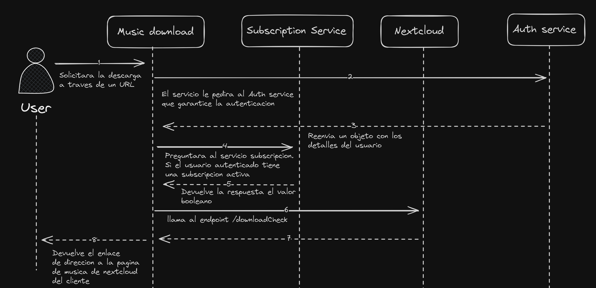

# Microservicio Music Downloader

# Propósito del microservicio

El objetivo es desarrollar un microservicio que en principio sería consumido por una futura aplicación web. Esta API permitirá a los usuarios descargar canciones de YouTube de forma más rápida y sencilla, almacenando estas mismas canciones dentro del propio almacenamiento en la nube del usuario que estará descargando la música.

## Enfoque del proyecto

Este microservicio va a **consumir algunos microservicios (_"MS"_)** como `Auth MS`, `Nextcloud MS` y `Subscription MS`.

Cuando un usuario desee descargar una canción, se llamará al endpoint `/download` del microservicio `MusicDownloader`. Este endpoint se encargará de realizar algunas validaciones previas a la ejecución de la lógica del microservicio. Algunas de las validaciones son:

- El usuario debe estar autenticado.
- El usuario debe tener un plan de suscripción activo.
- El usuario debe tener suficiente espacio en su almacenamiento para descargar las canciones.
- La ruta de descarga debe ser correcta.

Una vez todas esas validaciones pasen, se realizará la descarga de la canción utilizando la herramienta `yt-dlp`, que se encargará de descargar la canción y almacenarla en la ruta indicada por el usuario. [Ver issue](https://github.com/luishidalgoa/CloudStorage_Project/issues/1)

## Endpoints

### `{{url}}/MusicDownloader/api/v1/download`

> Devuelve el enlace de la carpeta donde se almacenaron las canciones descargadas.

**Header:**

```bash
Authorization: Basic {{base64_username:password}}
```

**Body:**

```json
{
  "user": {
    "uid": "string"
  },
  "data": {
    "externalUrl": "https://www.youtube.com/watch?v=QH2_TGUlwu4", // Url de la canción
    "DirectoryPath": "/new%folder" // Ruta de descarga indicada por el usuario
  }
}
```

**Errores:**

- **401**: Credenciales inválidas.
- **404**: El enlace de descarga no existe.
- **1001**: El usuario no tiene un plan activo.
- **1002**: El usuario no tiene suficiente espacio en su almacenamiento para descargar la canción.
- **1003**: La ruta de descarga no existe.

# Diagramas
## Diagrama arquitectura microservicios


## Diagrama de secuencia



# Microservicios consumidos

## **Auth microservice:**

### `{{url}}/auth/api/v1/me`

**Descripción:**

> Obtiene la información del usuario autenticado.

**Method:** GET

**Header:**

```bash
Authorization: Basic {{base64_username:password}}
```

**Response:**

```json
{
  "valid": true,
  "userId": "string",
  "roles": ["string"]
}
```

---

### `{{url}}/auth/api/v1/verify-token`

**Descripción:**

> Verifica si el token es válido.

**Header:**

```bash
Authorization: Basic {{base64_username:password}}
```

**Response:**

```json
true
```

## **NextCloud**

### `/nextcloud/api/v1/directory-list`

**Descripción:**

> Devuelve los elementos hijos dentro del directorio indicado del usuario dueño del token.

**Header:**

```bash
Authorization: Basic {{base64_username:password}}
```

**Body:**

```json
{
    "user": {
        "uid": "string"
    },
    "path": "/" // Indica el directorio raíz del usuario
}
```

**Response:**

```json
[
    {
        "href": "/nextcloud/remote.php/dav/files/luishidalgoa/",
        "propstat": {
            "prop": {
                "getlastmodified": "Wed, 11 Dec 2024 15:27:54 GMT",
                "resourcetype": {
                    "collection": {}
                },
                "quota-used-bytes": 365435363,
                "quota-available-bytes": 214382929437,
                "getetag": "\"6759af7a33f89\""
            },
            "status": "HTTP/1.1 200 OK"
        }
    },
    {
        "href": "/nextcloud/remote.php/dav/files/luishidalgoa/Arquitectura.excalidraw",
        "propstat": {
            "prop": {
                "getlastmodified": "Wed, 04 Dec 2024 23:04:44 GMT",
                "getcontentlength": 197240,
                "resourcetype": {},
                "getetag": "\"7704b908aa6f925fb31a67f700401aac\"",
                "getcontenttype": "application/vnd.excalidraw+json"
            },
            "status": "HTTP/1.1 200 OK"
        }
    },
    {
        "href": "/nextcloud/remote.php/dav/files/luishidalgoa/Nueva%20carpeta/",
        "propstat": {
            "prop": {
                "getlastmodified": "Wed, 11 Dec 2024 09:48:13 GMT",
                "resourcetype": {
                    "collection": {}
                },
                "quota-used-bytes": 1678,
                "quota-available-bytes": 214382929437,
                "getetag": "\"67595fdd6cb14\""
            },
            "status": "HTTP/1.1 200 OK"
        }
    }
]
```

---

### `{{url}}/nextcloud/api/v1/downloadCheck`

**Descripción:**

> Verifica si la ruta de descarga indicada es correcta y si hay suficiente espacio disponible en el almacenamiento del usuario, devolviendo `true` o `false` en base a si hay o no suficiente espacio y si la ruta es correcta.

**Header:**

```bash
Authorization: Basic {{base64_username:password}}
```

**Body:**

```json
{
    "user": {
        "uid": "string"
    },
    "path": "/new%folder", // Ruta de descarga indicada por el usuario
    "size": 4194304 // Tamaño en bytes del archivo
}
```

**Response:**

```json
{
  "success": true
}
```

**Errores:**

- **1002**: Almacenamiento insuficiente.
- **1003**: Ruta de descarga incorrecta.

---

